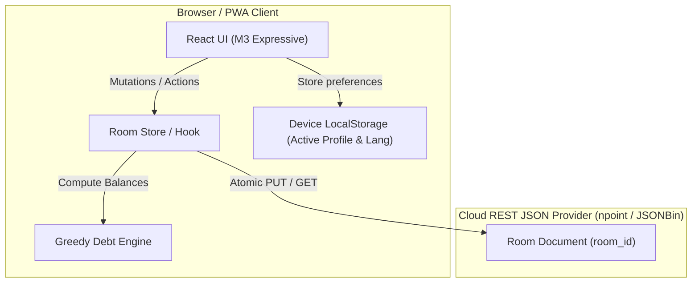

# Design Document: Friends Expense & Debt Tracker (Vercel PWA)

**Date**: 2026-09-17  
**Status**: Approved / Ready for Implementation  
**Tech Stack**: React 18+ (Vite), Tailwind CSS (Material 3 Expressive Tokens), Lucide Icons, Canvas-Confetti, vite-plugin-pwa, Remote REST JSON storage (npoint.io / JSONBin)

---

## 1. Executive Summary & Goals

A zero-backend, zero-authentication Progressive Web App (PWA) tailored for WhatsApp friend groups to effortlessly track group expenses, calculate net balances, minimize debt transactions (Greedy Cash Flow / Min Cash Flow debt simplification), and settle debts in one click with instant WhatsApp confirmations.

### Key Tenets
1. **Zero Backend / Cloud-First Shared State**: State is persisted to a free, auto-provisioned remote REST JSON endpoint (`?room=<id>`). No custom servers, databases, or manual user API key configurations.
2. **Zero Auth / Trust Model**: No passwords, logins, or tokens. Any friend selects their identity from the participant list to view personalized balances.
3. **Material Design 3 (Expressive)**: Strict adherence to Google M3 Expressive visual foundations (tonal containers, `Google Sans` typography, dynamic elevation/shapes, floating FAB, spring motion).
4. **Multilingual (i18n)**: Full localization across Azerbaijani (`az`, default), Russian (`ru`), and English (`en`), including dynamic debt-collapse explanation logs.
5. **PWA & Offline Capable**: Installable on iOS/Android home screens with Web Notifications and Service Worker shell caching.

---

## 2. Architecture & Remote Data Sync



### 2.1. Room Lifecycle & Auto-Provisioning
- **Room Creation**: When opening the app root without a query param, the user sees a quick setup screen: "Yeni Qrup Yarat" (Create New Group) or "Qrupa Qoşul" (Enter Room ID).
- **Auto-Provision**: On group creation, the app sends a `POST` request to the remote JSON provider (e.g. `npoint.io` or `jsonbin`), generating a new bin with initial state and routing to `?room=<binId>`.
- **Sync & Fetching**: 
  - Direct `GET` on load and window focus / network reconnect.
  - Active background polling (every 8-10 seconds) with an unobtrusive sync indicator chip.
  - Every update (expense added/deleted, debt settled) issues an atomic `PUT` or `POST` to the remote provider with optimistic UI feedback and rollback on error.

---

## 3. Domain Model & Debt Simplification

### 3.1. TypeScript Interfaces
```typescript
export interface Participant {
  id: string;
  name: string;
  avatarColor: string;
}

export interface SplitItem {
  participantId: string;
  amount: number;
}

export interface Expense {
  id: string;
  title: string;
  amount: number;
  payerId: string;
  date: string;
  splitMode: 'equal' | 'custom';
  involvedParticipantIds: string[];
  customSplits?: SplitItem[];
  createdAt: number;
}

export interface Settlement {
  id: string;
  fromParticipantId: string;
  toParticipantId: string;
  amount: number;
  date: string;
  createdAt: number;
}

export interface RoomState {
  id: string;
  groupName: string;
  currency: string; // default "₼"
  participants: Participant[];
  expenses: Expense[];
  settlements: Settlement[];
  updatedAt: number;
}

export interface SimplifiedTransfer {
  fromParticipantId: string;
  toParticipantId: string;
  amount: number;
  explanation: {
    az: string;
    ru: string;
    en: string;
  };
}
```

### 3.2. Debt Simplification Algorithm
1. **Net Balance Calculation**:
   $$\text{Balance}_i = \sum \text{Paid By } i - \sum \text{Consumed By } i + \sum \text{Settled By } i - \sum \text{Settled To } i$$
2. **Greedy Matching**:
   - Separate balances into Debtor queue ($< 0$) and Creditor queue ($> 0$).
   - Sort both descending by absolute amount.
   - Greedily pair the largest debtor with the largest creditor:
     $$\text{transfer} = \min(|\text{debtor.balance}|, \text{creditor.balance})$$
   - Generate multi-language trace strings (e.g., in AZ: *«Əməliyyatların sayını azaltmaq üçün Elvinin Raufa olan 15 ₼ borcu Çingizə yönləndirildi»*).
   - Continue until all balances reach 0 within 0.01 precision.

---

## 4. UI/UX: Material Design 3 Expressive Foundations

### 4.1. Design Tokens & Styling
- **Typography**: Google Sans (`Product Sans` / `Google Sans Text`), with scale:
  - `Display Large/Medium`: Header numbers and hero metrics.
  - `Headline / Title`: Section headers, card titles.
  - `Body / Label`: Inputs, lists, chip labels.
- **Color System (M3 Tonal Palettes)**:
  - `Primary / On-Primary`: Deep Teal / Emerald accent `#006A60` / `#FFFFFF`.
  - `Primary Container / On-Primary Container`: `#70F7E5` / `#00201C`.
  - `Surface Container / Surface Container High`: `#F2F4F7` / `#E8ECEF` (light) & dark-mode adapted tonal surfaces.
  - `Secondary Container`: Amber/Tonal for balances and alerts.
  - `Error / Error Container`: Red tints `#BA1A1A` / `#FFDAD6`.
- **Shapes & Radii**:
  - Cards & Dialogs: `rounded-3xl` (28px).
  - Chips & Action Buttons: `rounded-full` (9999px).
  - Floating Action Button (FAB): `rounded-2xl` (16px) with elevation-3 shadow.

### 4.2. View Structure & Component Hierarchy
```
AppRoot
├── AppHeader (Profile Switcher, Room Code & Copy, Lang Selector, Notification Bell, Help Dialog)
├── HeroBalanceCard (Personalized Net Balance: "Sizə borcludurlar" / "Sizin borcunuz var" / "Balans təmizdir")
├── TabNavigation (Segmented pill bar)
│   ├── Tab 1: Transfers & Settle-Up (Optimized transfers, one-click settle, WhatsApp share button)
│   ├── Tab 2: Tarixçə / History (Chronological ledger with edit/delete modals)
│   └── Tab 3: Şərəf Lövhəsi / Hall of Fame (Gamification badges & statistics)
├── Modals & Dialogs
│   ├── Add/Edit Expense Dialog (Equal / Flexible split, payer selector, date, amount)
│   ├── Settle Confirmation & WhatsApp Share Dialog (Confetti canvas, Web Notification trigger)
│   ├── Add Participant Dialog
│   └── Help & Info Dialog (How it works, debt collapse explainer, PWA install guide, trust model)
└── FloatingActionButton (+) (Bottom-right sticky trigger for adding expense)
```

---

## 5. Gamification System ("Şərəf Lövhəsi")

Dynamic metric-driven badges awarded automatically in real time:
1. ⚡ **«Gecənin sponsoru» / «Спонсор вечера» / «Sponsor of the Night»**: Participant who paid the highest total amount of group expenses.
2. ⚡ **«İldırım ödəyici» / «Молниеносный плательщик» / «Lightning Settler»**: Participant who settled debts most frequently / fastest.
3. 🐢 **«"Sabah ataram" bəy» / «Мистер "Завтра скину"» / «"I'll pay tomorrow" Sir»**: Participant with the oldest outstanding unsettled debt.
4. 🍕 **«Məclisin canı» / «Душа компании» / «Life of the Party»**: Participant involved in the highest number of gathering receipts.

---

## 6. WhatsApp Deep Linking & Notifications

### 6.1. WhatsApp Share Templates
1. **Settlement Confirmation (`wa.me/?text=...`)**:
   ```text
   ✅ Borc bağlandı!
   💸 [Borclu] ➡️ [Məbləğ] [Valyuta] ➡️ [Alan]
   Yığıncaq balansı yeniləndi.
   🔗 [App URL ilə ?room=...]
   ```
2. **Full Gathering Summary (`wa.me/?text=...`)**:
   ```text
   🍻 Yığıncaq nəticələri: [Məkan/Təsvir]
   💰 Ümumi hesab: [Məbləğ] [Valyuta] (ödədi: [Ad])

   📋 Kim kimə köçürür (optimallaşdırılmış):
   • [Borclu] ➡️ [Məbləğ] [Valyuta] ➡️ [Alan]

   🔗 Balansı yoxlamaq və borcları bağlamaq: [App URL]
   ```

### 6.2. Web Notification API
- Requests permission gracefully upon tapping notification icon.
- Fires local notifications when:
  - Debt settled (`Borc bağlandı! 🎉`).
  - Major expense added.
  - New title earned in Hall of Fame.

---

## 7. Delivery Artifacts & Deployment
- Static production build configured for seamless single-command Vercel deployment (`vercel` or GitHub import).
- Comprehensive `README.md` with Vercel deployment steps.
- Complete standalone PWA configuration with Service Worker caching and icons.
